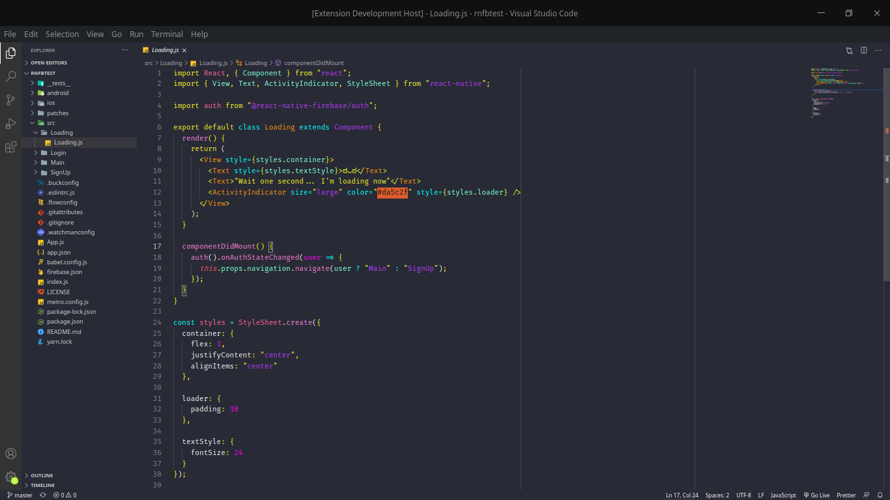
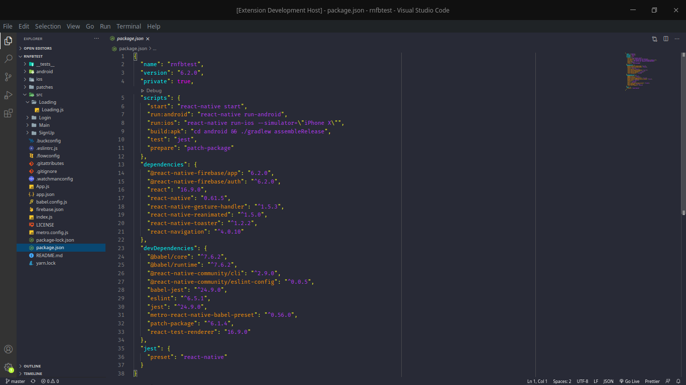

# darkniuncor - Dark Unicorn

ಠ▃ಠ - "Eh, full of candy and rainbows or mischief and destruction ???"

ヾ(≧∇≦)ゞ - "Full of candy and rainbows !!!"

(꒪⌓꒪) - "Hmm, mischief and destruction ?!"

## screenshots

| JS | JSON |
|----|------|
|||

## :runner: To run this project (running locally) ?

```shell
# use your terminal/cmd to clone this repository

git clone https://github.com/nicknamedelta/darkniuncor-theme.git

# access darkniuncor-theme folder

cd darkniuncor-theme

# preview theme in vscode

'fn + f5' (in Mac) or just 'f5'
```
More information about the tests: [CSSTricks - test drive](https://css-tricks.com/creating-a-vs-code-theme/#test-drive);

## color palette
<details>
  <summary><a href="http://colorsafe.co/">colorsafe</a> generate accessible text colors:</summary>
  
-  `#263238`
-  `#eeeeee`
-  `#baf73c`
-  `#bbbbbb`
-  `#546e7a`
-  `#fc6399`
-  `#ff00ff`
-  `#ff5370`
-  `#00ffff`
-  `#f1f227`
-  `#7fffd4`
-  `#f283d1`
-  `#b93cf6`
-  `#f89406`
-  `#c17e70`
-  `#65737e`
-  `#00000050`
</details>

**Based on:**

- [CSSTricks - creating a vscode theme](https://css-tricks.com/creating-a-vs-code-theme/);
